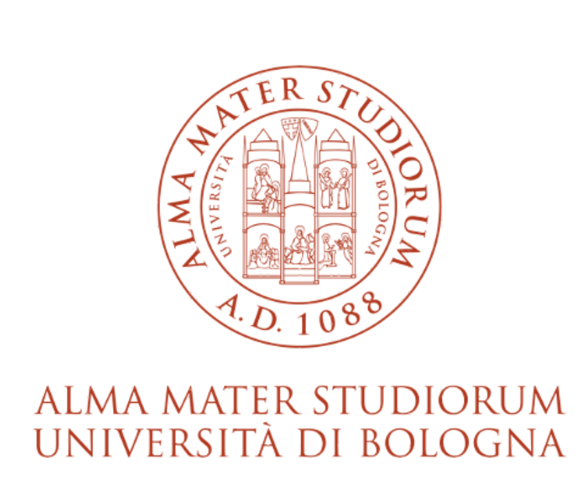

# University of Bologna Official Beamer Template

LaTeX Beamer template that reproduces the official PowerPoint visual identity of the University of Bologna.

Designed for academic presentations, seminars, lectures, and conferences.

---

## Author
Laura Croccolo  
PhD Candidate — University of Bologna  
GitHub: @LauraCroccolo

---

## Preview


---

## Features
- Official University of Bologna colors and branding
- Institutional title slide
- Clean and professional academic layout
- Consistent typography and spacing
- Ready-to-use example presentation
- Fully customizable Beamer structure

---

## Getting Started

### 1. Download or clone the repository
```bash
git clone https://github.com/<username>/unibo-beamer-template.git
